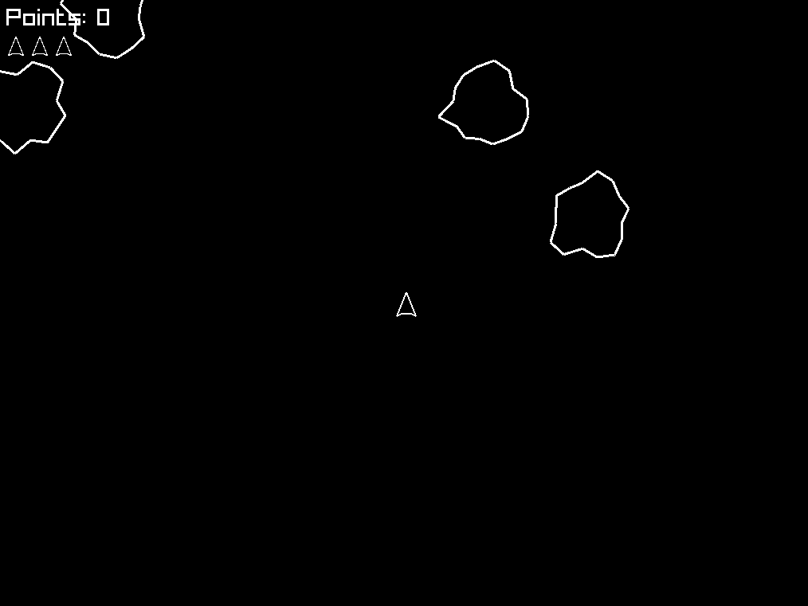

# Asteroids
This is a clone of the popular classic video game Asteroids written in the Odin programming language. You can play it by flying around with the up arrow key and turning with the left and right arrow keys. Shoot projectiles by pressing the spacebar.

This is how it looks:

To run the game simply run the command `odin run .` from the root directory. Keep in mind that for the audio to work as well you can't change the directory of the executable from the project's root unless you make changes to the source code as well.
